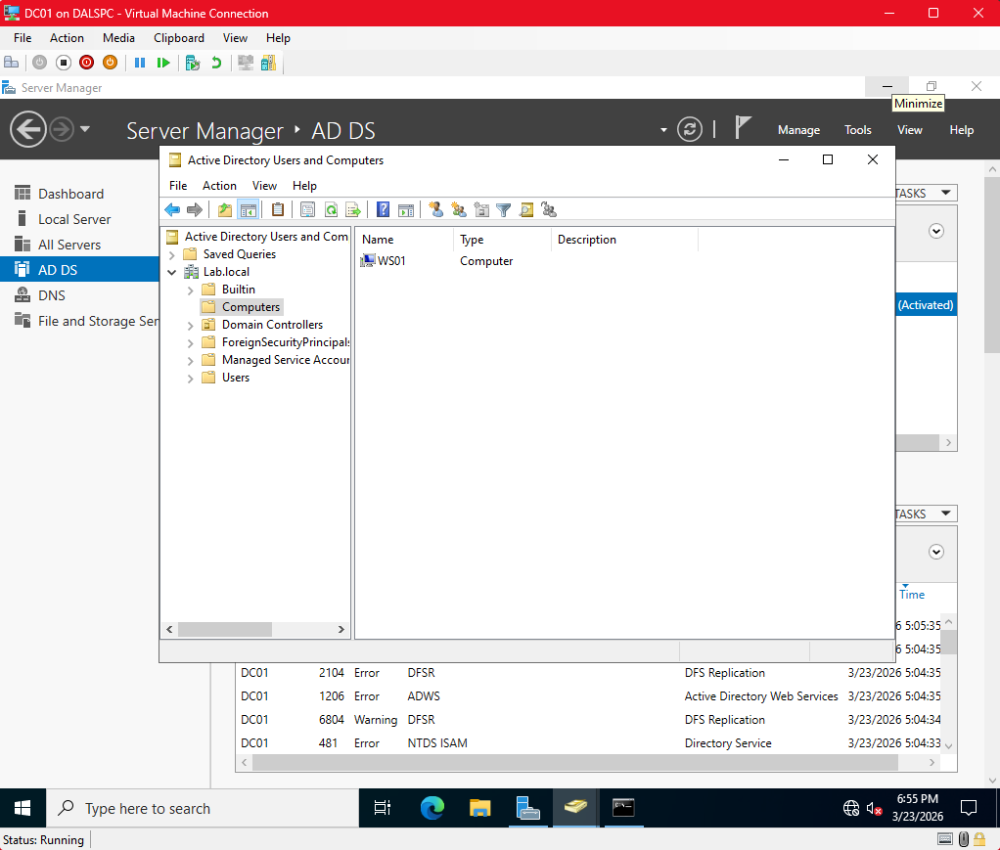
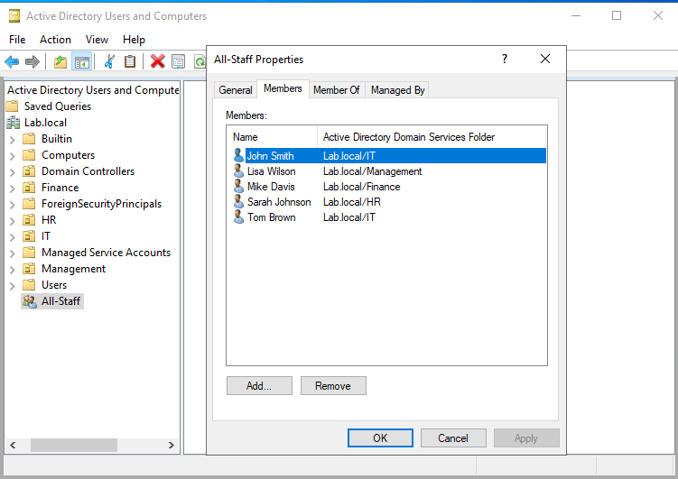
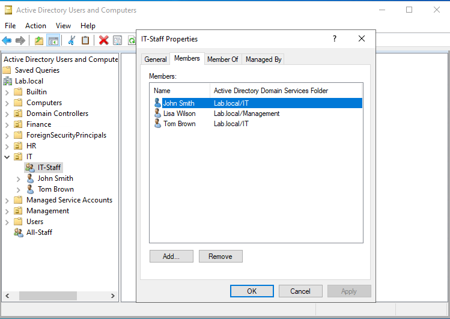
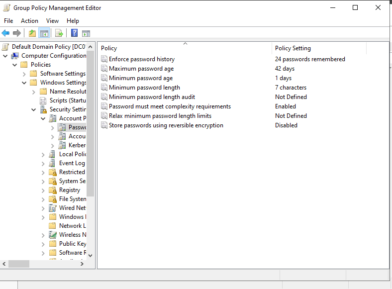

# Active Directory Home Lab

## Overview
Designed and deployed a virtualized Active Directory environment from scratch 
using Hyper-V on Windows 11 Pro. This lab simulates a real enterprise 
environment with a Domain Controller and a domain-joined workstation.

---

## Lab Architecture

| VM | Role | OS | IP Address |
|---|---|---|---|
| DC01 | Domain Controller / DNS Server | Windows Server 2022 Standard | 192.168.10.10 |
| WS01 | Domain-Joined Workstation | Windows 11 Enterprise | 192.168.10.20 |

**Hypervisor:** Microsoft Hyper-V (built into Windows 11 Pro)  
**Virtual Switch:** Internal switch (LabNetwork) — isolated lab network  
**Domain:** lab.local  

---

## What Was Built

- Enabled Hyper-V on Windows 11 Pro host machine
- Created an internal virtual switch (LabNetwork) to isolate lab traffic
- Deployed Windows Server 2022 as a Domain Controller (DC01)
- Configured static IP addressing on both VMs
- Installed Active Directory Domain Services (AD DS)
- Promoted DC01 to Domain Controller for the lab.local domain
- Configured DNS on DC01 pointing to itself (127.0.0.1)
- Deployed Windows 11 Enterprise as a workstation (WS01)
- Joined WS01 to the lab.local domain
- Created domain user accounts in Active Directory
- Verified domain join via Active Directory Users and Computers

## Screenshots

### Hyper-V Manager — Both VMs Running

### Active Directory — WS01 Joined to Domain

### WS01 — Domain Login Screen

---

## Troubleshooting Encountered

### Issue 1 — Secure Boot blocking Windows 11 ISO
**Symptom:** VM showed "signed image hash not allowed" error on boot  
**Cause:** Hyper-V Secure Boot template was incompatible with the ISO  
**Fix:** Disabled Secure Boot in VM security settings to allow installation

### Issue 2 — TPM 2.0 requirement blocking Windows 11 install
**Symptom:** Setup showed "This PC doesn't meet Windows 11 requirements"  
**Cause:** Hyper-V VM did not have TPM 2.0 enabled  
**Fix:** Disabled Secure Boot and enabled Trusted Platform Module (TPM 2.0) 
in VM Security settings in Hyper-V Manager

### Issue 3 — DNS queries timing out between VMs
**Symptom:** nslookup lab.local timing out on WS01 despite correct DNS settings  
**Cause:** DNS service on DC01 was not responding after initial configuration  
**Fix:** Restarted DNS service on DC01 using Restart-Service DNS in PowerShell. 
Also disabled Windows Firewall temporarily during initial lab configuration

### Issue 4 — Domain join failing with "DC could not be contacted"
**Symptom:** WS01 could not find lab.local domain controller  
**Cause:** DNS was not resolving before DNS service restart  
**Fix:** Confirmed DNS resolution with nslookup lab.local from WS01 
after DNS restart, then successfully joined domain

---

## Key Concepts Demonstrated

- Hypervisor deployment and VM provisioning
- Active Directory Domain Services installation and configuration
- Domain Controller promotion
- DNS configuration for AD environments
- Static IP addressing in a lab network
- Domain join process and authentication
- Troubleshooting DNS resolution failures
- Windows Firewall management
- Registry editing for OS compatibility

---

## Next Steps in This Lab

- [x] Create Organizational Units (OUs) for departments
- [x] Create and manage domain user accounts
- [ ] Implement Group Policy Objects (GPOs)
- [ ] Map shared network drives via GPO
- [ ] Practice common help desk tasks — password resets, account lockouts
- [ ] Add DHCP role to DC01
- [ ] Document PowerShell AD administration commands

---

## User and Group Management

### What Was Built
- Created four Organizational Units: IT, HR, Finance, Management
- Provisioned 5 domain user accounts across department OUs
- Created security groups: IT-Staff, HR-Staff, Finance-Staff, 
  Management-Staff, All-Staff
- Added users to department groups and All-Staff group
- Practiced core help desk tasks: password resets, account disable/enable

### Screenshots

#### OU Structure

#### All-Staff Group — All Users Across Departments

#### IT-Staff Group — Cross-Department Assignment

#### Password Reset — Successful

#### Account Disabled

#### Password Policy — Default Domain Policy

### Troubleshooting Encountered
**Issue: Password reset failed — complexity requirements not met**  
Symptom: "Password does not meet password policy requirements"  
Cause: Default Domain Policy enforces complexity requirements  
Fix: Used compliant password. Located policy in Group Policy Management 
→ Default Domain Policy → Account Policies → Password Policy

## Skills This Lab Demonstrates

**Relevant to:** Help Desk, Desktop Support, Systems Administrator, 
NOC Technician, Junior SysAdmin roles

- Windows Server administration
- Active Directory management
- DNS troubleshooting
- Network configuration
- VM deployment and management
- Technical troubleshooting and documentation
