# Active Directory Home Lab

## Overview
Designed and deployed a virtualized Active Directory environment from scratch 
using Hyper-V on Windows 11 Pro. This lab simulates a real enterprise 
environment with a Domain Controller and a domain-joined workstation.

---

## Lab Architecture

| VM | Role | OS | IP Address |
|---|---|---|---|
| DC01 | Domain Controller / DNS Server | Windows Server 2022 Standard | 192.168.10.10 |
| WS01 | Domain-Joined Workstation | Windows 11 Enterprise | 192.168.10.20 |

**Hypervisor:** Microsoft Hyper-V (built into Windows 11 Pro)  
**Virtual Switch:** Internal switch (LabNetwork) — isolated lab network  
**Domain:** lab.local  

---

## What Was Built

- Enabled Hyper-V on Windows 11 Pro host machine
- Created an internal virtual switch (LabNetwork) to isolate lab traffic
- Deployed Windows Server 2022 as a Domain Controller (DC01)
- Configured static IP addressing on both VMs
- Installed Active Directory Domain Services (AD DS)
- Promoted DC01 to Domain Controller for the lab.local domain
- Configured DNS on DC01 pointing to itself (127.0.0.1)
- Deployed Windows 11 Enterprise as a workstation (WS01)
- Joined WS01 to the lab.local domain
- Created domain user accounts in Active Directory
- Verified domain join via Active Directory Users and Computers

### Screenshots

#### Hyper-V Manager — Both VMs Running
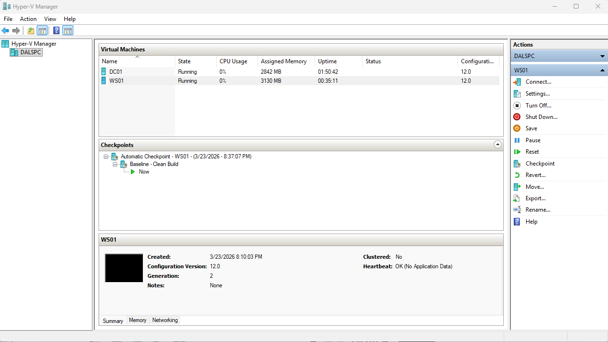

#### Active Directory — WS01 Joined to Domain

#### WS01 — Domain Login Screen
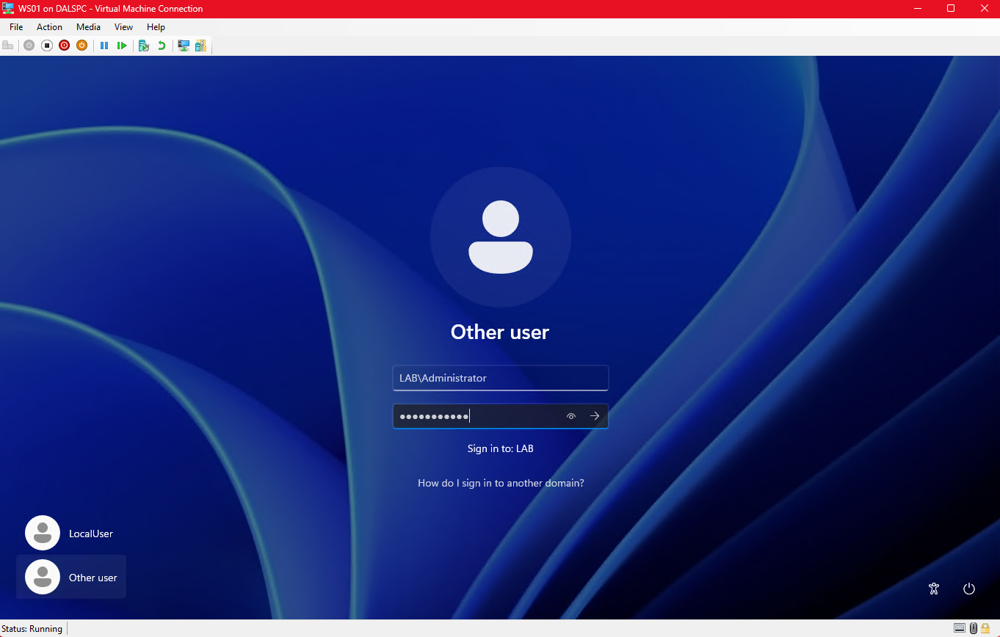

---

## Troubleshooting Encountered

### Issue 1 — Secure Boot blocking Windows 11 ISO
**Symptom:** VM showed "signed image hash not allowed" error on boot  
**Cause:** Hyper-V Secure Boot template was incompatible with the ISO  
**Fix:** Disabled Secure Boot in VM security settings to allow installation

### Issue 2 — TPM 2.0 requirement blocking Windows 11 install
**Symptom:** Setup showed "This PC doesn't meet Windows 11 requirements"  
**Cause:** Hyper-V VM did not have TPM 2.0 enabled  
**Fix:** Disabled Secure Boot and enabled Trusted Platform Module (TPM 2.0) 
in VM Security settings in Hyper-V Manager

### Issue 3 — DNS queries timing out between VMs
**Symptom:** nslookup lab.local timing out on WS01 despite correct DNS settings  
**Cause:** DNS service on DC01 was not responding after initial configuration  
**Fix:** Restarted DNS service on DC01 using Restart-Service DNS in PowerShell. 
Also reconfigured Windows Firewall to allow traffic from port 53 (DNS) in PowerShell.

### Issue 4 — Domain join failing with "DC could not be contacted"
**Symptom:** WS01 could not find lab.local domain controller  
**Cause:** DNS was not resolving before DNS service restart  
**Fix:** Confirmed DNS resolution with nslookup lab.local from WS01 
after DNS restart, then successfully joined domain

---

## Key Concepts Demonstrated

- Hypervisor deployment and VM provisioning
- Active Directory Domain Services installation and configuration
- Domain Controller promotion
- DNS configuration for AD environments
- Static IP addressing in a lab network
- Domain join process and authentication
- Troubleshooting DNS resolution failures
- Windows Firewall management
- Registry editing for OS compatibility

---

## Lab Progress

- [x] Deploy Domain Controller and domain-joined workstation
- [x] Create Organizational Units and user accounts
- [x] Implement Group Policy Objects
- [x] Configure shared network drives with group-based permissions
- [x] Demonstrate RDP remote administration
- [ ] PowerShell bulk user provisioning (100+ users from CSV)

---

## User and Group Management

### What Was Built
- Created four Organizational Units: IT, HR, Finance, Management
- Provisioned 5 domain user accounts across department OUs
- Created security groups: IT-Staff, HR-Staff, Finance-Staff, 
  Management-Staff, All-Staff
- Added users to department groups and All-Staff group
- Practiced core help desk tasks: password resets, account disable/enable

### Screenshots

#### OU Structure
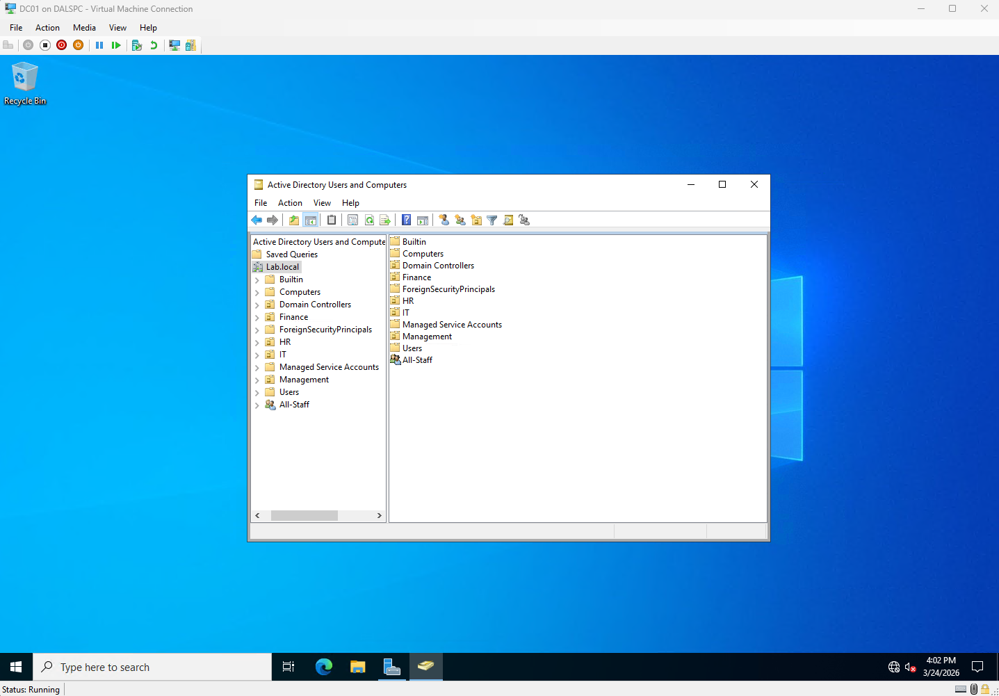

#### All-Staff Group — All Users Across Departments

#### IT-Staff Group — Cross-Department Assignment

#### Password Reset — Successful
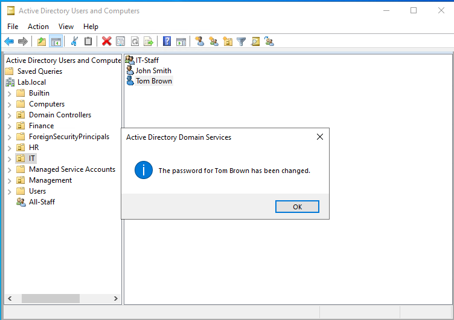

#### Account Disabled
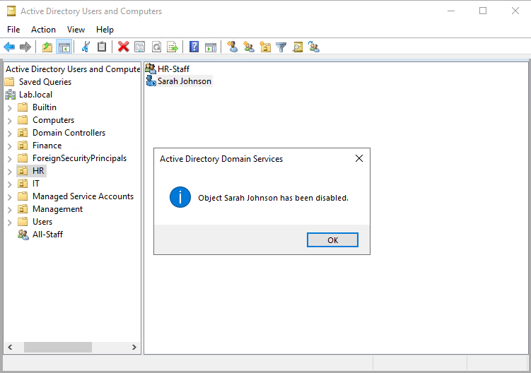

#### Password Policy — Default Domain Policy

### Troubleshooting Encountered
**Issue: Password reset failed — complexity requirements not met**  
Symptom: "Password does not meet password policy requirements"  
Cause: Default Domain Policy enforces complexity requirements  
Fix: Used compliant password. Located policy in Group Policy Management 
→ Default Domain Policy → Account Policies → Password Policy

---

## Group Policy Objects (GPOs)

### What Was Built
- Created and linked three GPOs to the lab.local domain
- **Lock-Screen-Policy:** Enforces 10-minute screen saver timeout 
  with password protection on all domain user sessions
- **Disable-USB-Storage:** Blocks all removable storage device 
  access via Computer Configuration policy
- **Corporate-Wallpaper-Policy:** Enforces standard desktop 
  wallpaper across all domain user sessions

### Verified Via
- `gpupdate /force` on WS01 to force immediate policy refresh
- `gpresult /r` to confirm user-side GPO application — confirmed 
  Lock-Screen-Policy and Corporate-Wallpaper-Policy applied
- `gpresult /r /scope computer` run as Administrator to confirm 
  computer-side GPO application; confirmed Disable-USB-Storage applied
- Visual confirmation of wallpaper change on WS01 after policy refresh

### Troubleshooting Encountered
**Issue 1: gpresult /r /scope computer returned Access Denied**  
Symptom: Running gpresult /scope computer as dallas.deas 
returned "ERROR: Access Denied"  
Cause: Even domain admin accounts run with a restricted UAC token 
by default. Computer-scope policy queries require explicit elevation.  
Fix: Re-ran command prompt as Administrator via right-click 
"Run as administrator"; command succeeded immediately

**Issue 2: Local account on WS01 did not receive Corporate Wallpaper GPO**  
Symptom: LocalUser account on WS01 showed original wallpaper, 
not the GPO-enforced wallpaper  
Cause: GPOs only apply to domain accounts. Local accounts exist 
outside the domain and bypass all domain group policy entirely.  
Resolution: Confirmed expected behavior. GPO applied correctly 
to domain account LAB\dallas.deas. This highlights why enterprises 
disable or restrict local accounts on domain-joined machines;
local accounts can bypass centralized policy enforcement.

### Key Concepts Demonstrated
- GPO creation and domain-level linking in Group Policy Management
- User Configuration vs Computer Configuration policy distinction
- GPO scope — user-side vs computer-side policy application
- UAC token elevation behavior for domain admin accounts
- Client-side policy refresh using gpupdate and gpresult
- Security policy enforcement across domain workstations
- Why local accounts are restricted in enterprise environments

### Screenshots

#### All Three GPOs Linked to lab.local
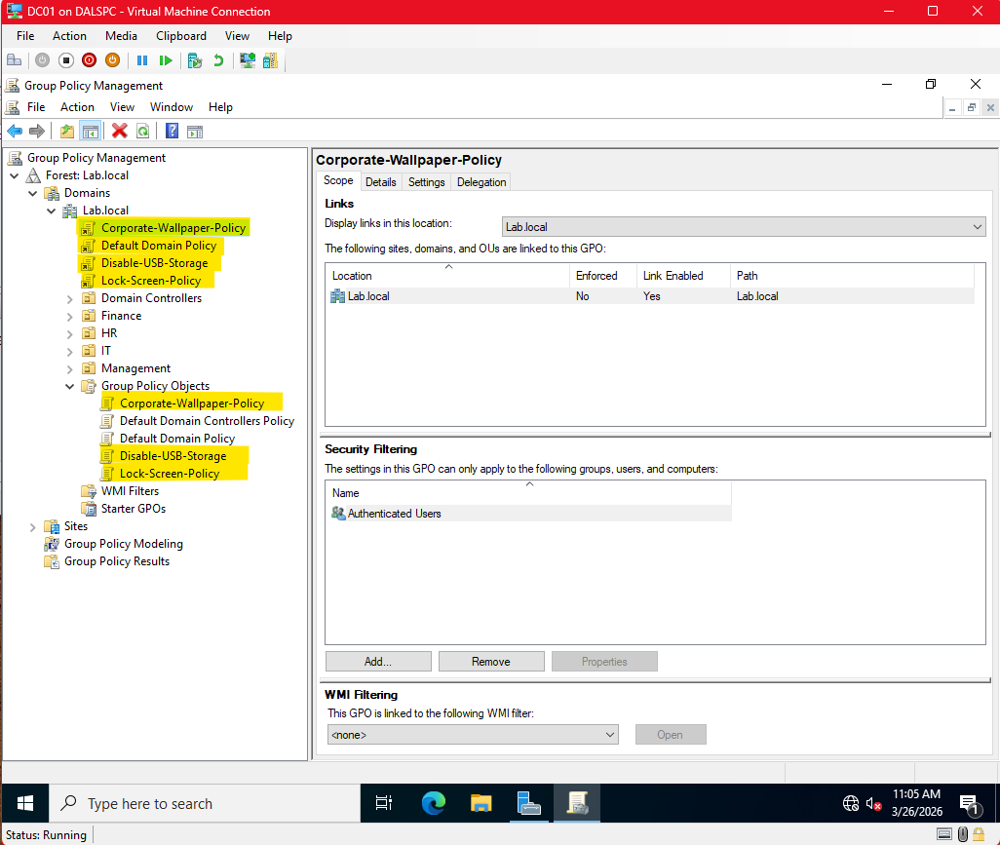

#### GPResult — User-Side Policies Applied on WS01
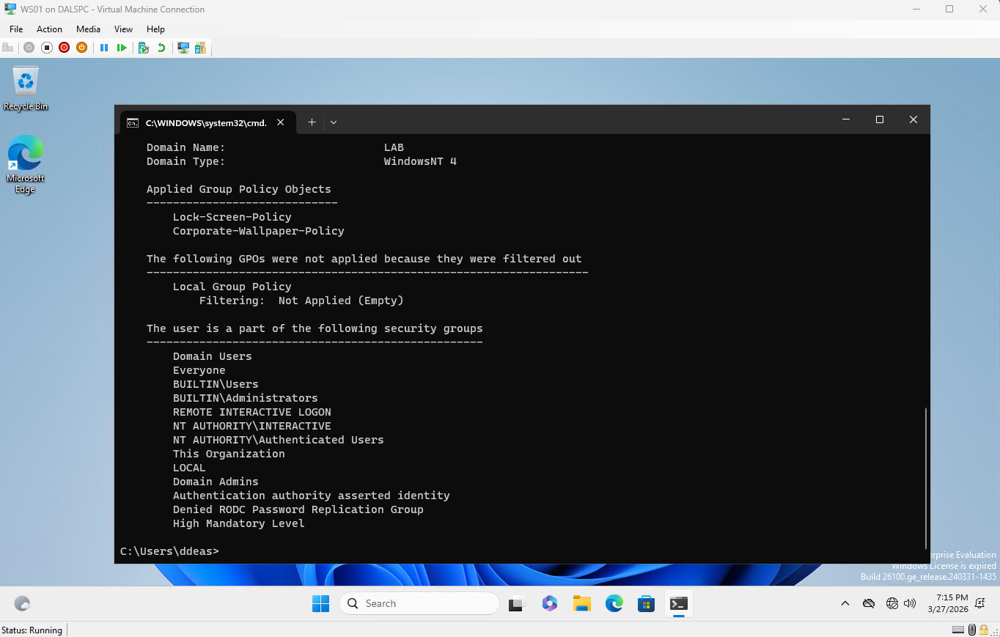

#### GPResult Scope Computer — Disable-USB-Storage Applied
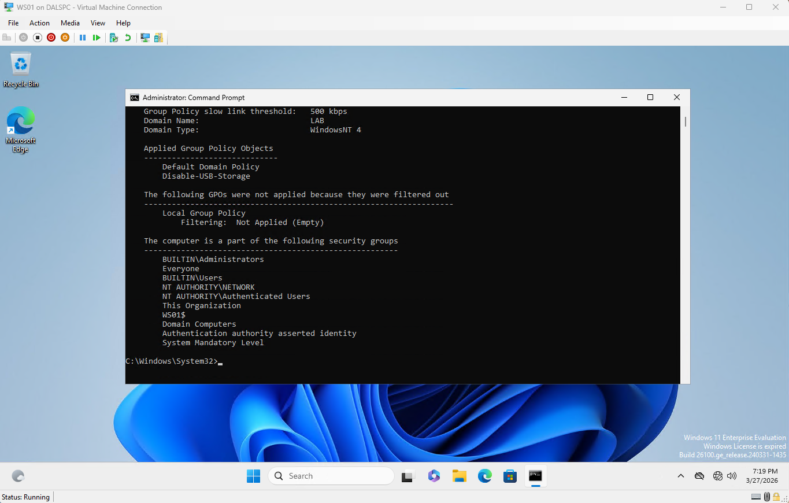

---

## Shared Network Drives and Remote Desktop Protocol (RDP)

### What Was Built
- Created three shared folders on DC01: IT, HR, and AllStaff 
  located at C:\Shares
- Configured share-level permissions restricting access by 
  security group — IT-Staff for IT share, HR-Staff for HR share, 
  All-Staff for AllStaff share
- Created Drive-Mapping-Policy GPO using Group Policy Preferences 
  with item-level targeting to automatically map drives based on 
  group membership:
  - Z: AllStaff mapped to all staff members
  - Y: IT mapped to IT-Staff group members only
  - X: HR mapped to HR-Staff group members only
- Enabled Remote Desktop Protocol on WS01 and added Domain Admin 
  to Remote Desktop Users group
- Demonstrated RDP remote administration by connecting from DC01 
  to WS01 using `mstsc`

### Verified Via
- net share command on DC01 confirming all three shares active
- Logged in as dallas.deas — confirmed IT (Y:) and AllStaff (Z:) 
  mapped correctly based on group membership
- Logged in as sarah.johnson — confirmed HR (X:) and AllStaff (Z:) 
  mapped correctly, IT drive not present as expected
- RDP session established from DC01 to WS01 at 192.168.10.20

### Troubleshooting Encountered
**Issue 1: Drive mapping GPO applied but drives not appearing**  
Symptom: gpresult showed Drive-Mapping-Policy applied but no 
network drives appeared in File Explorer  
Cause: dallas.deas was not a member of All-Staff or IT-Staff. 
Item-level targeting requires group membership to map drives.  
Fix: Added dallas.deas to All-Staff and IT-Staff groups in AD. 
Logged off and back in — drives appeared immediately.

**Issue 2: Domain Admins denied access to HR share**  
Symptom: Accessing \\DC01\HR returned "You do not have permission"  
Cause: Share permissions only granted HR-Staff access. Domain Admins 
were not explicitly added to share-level permissions.  
Fix: Added Domain Admins to HR share permissions with Full Control. 
This highlighted the difference between share permissions and NTFS 
permissions — two separate security layers in Windows.

**Issue 3: DC01 dependency learned**  
Observation: When DC01 was powered off, WS01 could not resolve the 
domain, apply GPOs, map drives, or authenticate domain users.  
Resolution: DC01 must always be running before WS01. In production 
environments this is solved with redundant domain controllers so no 
single DC going offline takes down the entire domain.

### Key Concepts Demonstrated
- Network share creation and share-level permission configuration
- Group Policy Preferences for drive mapping automation
- Item-level targeting for group-based drive assignment
- Domain Controller dependency in Active Directory environments
- RDP configuration and remote workstation administration
- Domain Users group management for session access control

### Screenshots

#### Shared Folders Created on DC01
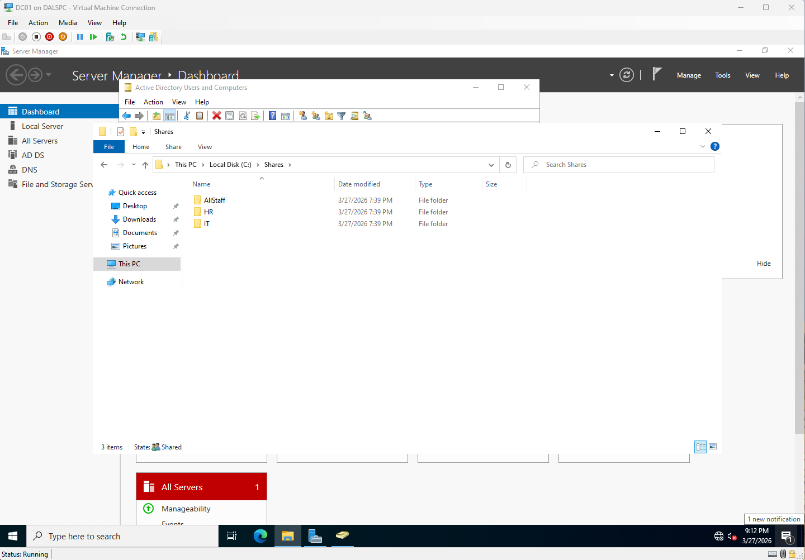

#### Net Share — Confirming Active Shares
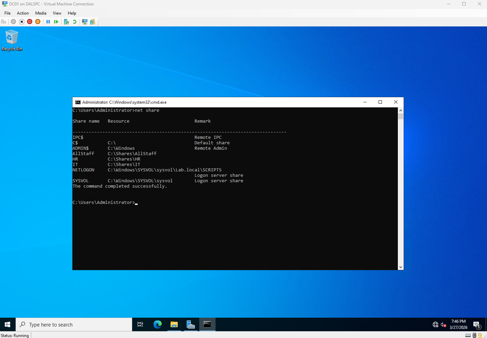

#### Drive Mapping GPO — Three Drives Configured
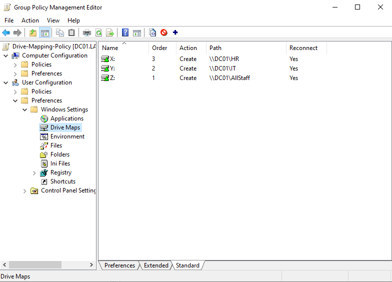

#### Sarah Johnson — HR and AllStaff Drives Only
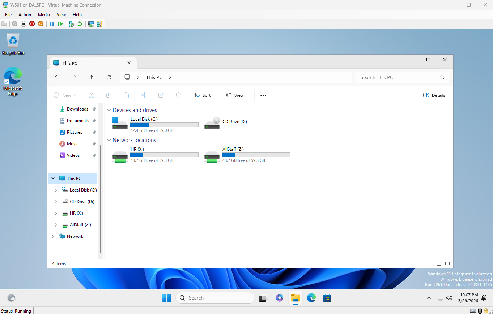

#### RDP Connection Initiated from DC01 to WS01
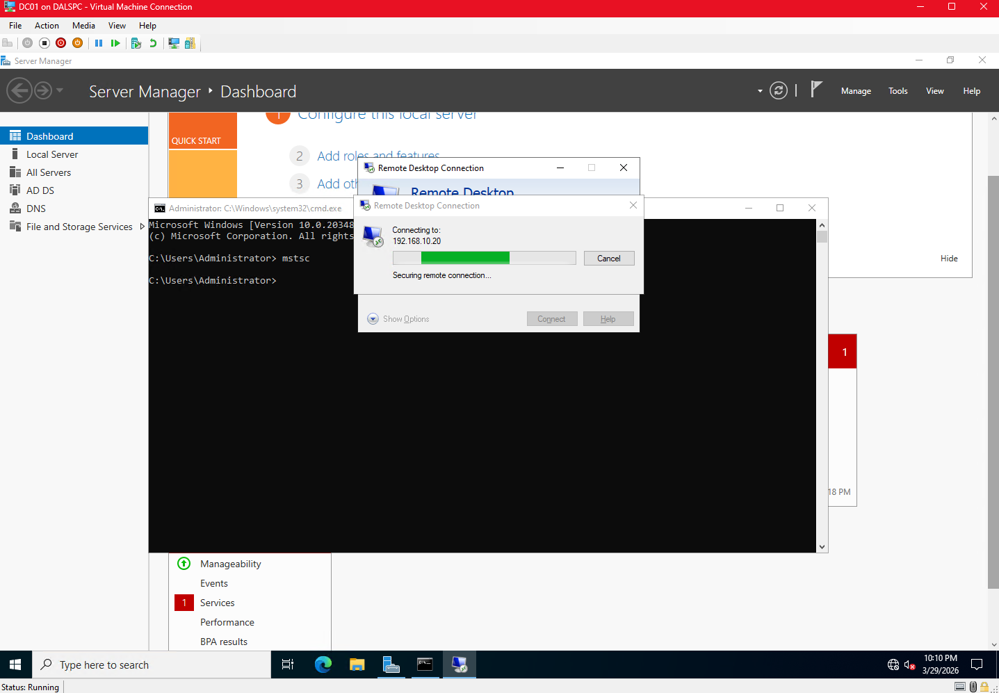

#### Active RDP Session — WS01 Remotely Administered from DC01
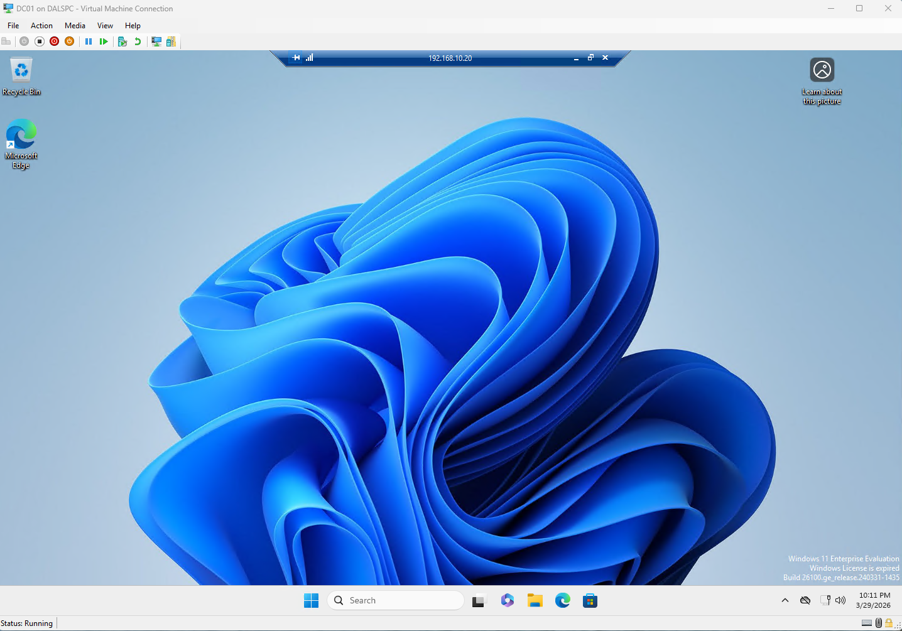

---

## Skills This Lab Demonstrates

**Relevant to:** Help Desk, Desktop Support, Systems Administrator, 
NOC Technician, Junior SysAdmin roles

- Windows Server administration
- Active Directory management
- DNS troubleshooting
- Network configuration
- VM deployment and management
- Group Policy administration
- Network share and permissions management
- Remote Desktop Protocol administration
- Technical troubleshooting and documentation
